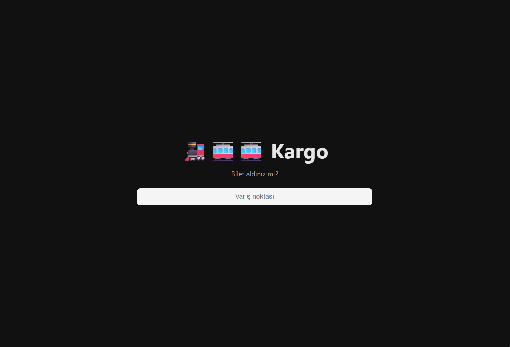
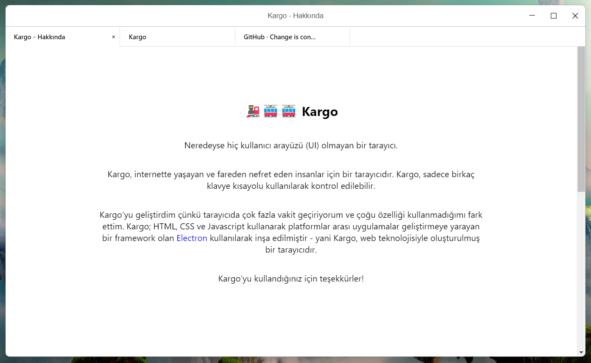

<p align="center">
  
  <h1 align="center">Kargo</h1>
</p>

<p align="center">
  Neredeyse hiç kullanıcı arayüzü (UI) olmayan bir tarayıcı.
</p>

Kargo, internette yaşayan ve fareden nefret eden insanlar için bir tarayıcıdır. Kargo, sadece birkaç klavye kısayolu kullanılarak kontrol edilebilir. Kargo, bir tarayıcının sadece en kullanışlı özelliklerini içerir; bu sayede internette gezinirken gereksiz özellikler sizi rahatsız edemez. Kargo'yu geliştirdim çünkü tercih ettiğim tarayıcıların (Chrome ve Firefox) sahip olduğu çoğu özelliği kullanmıyordum.

Kargo henüz çok erken aşamadadır ancak şimdiden kullanılabilir durumdadır; lütfen geliştirmeme yardımcı olun.

Denemek veya yüklemek için önceden derlenmiş [sürümlerimizden (binaries)](https://github.com/aardaakpinar/kargo/releases/latest) birini kullanabilirsiniz.

## Özellikler

 - __Chrome__: Kargo, gücünü Chromium'dan alan Electron'un webview etiketlerini kullanır.
 - __Sekmeler__: Diğer tüm tarayıcılar gibi Kargo da sekmeleri destekler, ancak bunları sizden gizler.
 - __Geliştirici Araçları__: Kargo, Chrome'un geliştirici araçlarını tam olarak destekler.
 - __Platformlar arası__: Kargo tüm platformlarda iyi görünür, Windows'taki başlık çubuğu bile şık durur.
 - __Basit__: Kargo sadece çoğu insanın ihtiyaç duyduğu özelliklere sahiptir.
 - __Sekme Kurtarma__: Kargo, açıldığında önceden açık olan sekmelerinizi otomatik olarak geri yükler.
 - __Çok şirin__: 🚂🚋🚋 Kargo (web'i evinize taşır).

## Ekran Görüntüleri

##### Windows üzerinde Kargo ana sayfası



##### Duckduckgo (varsayılan arama motoru)


##### Windows üzerinde Kargo hakkında sayfası



##### Karanlık Mod (DarkMode)


## Klavye Kısayolları

<table>
  <tr>
      <td class="shortcut">ctrl + tab</td>
      <td>Sekme çubuğunu göster/gizle</td>
  </tr>
  <tr>
      <td class="shortcut">ctrl + enter</td>
      <td>www. + .com ekle</td>
  </tr>
  <tr>
      <td class="shortcut">ctrl + shift + l</td>
      <td>Tema değiştir</td>
  </tr>
  <tr>
      <td class="shortcut">ctrl + m</td>
      <td>Menü aç</td>
  </tr>
  <tr>
      <td class="shortcut">ctrl + h</td>
      <td>Geçmişi aç</td>
  </tr>
  <tr>
      <td class="shortcut">ctrl + shift + d</td>
      <td>Geliştirici araçlarını aç</td>
  </tr>
  <tr>
      <td class="shortcut">ctrl + shift + a</td>
      <td>Hakkında sayfasını aç</td>
  </tr>
  <tr>
      <td class="shortcut">ctrl + sol</td>
      <td>Geri git</td>
  </tr>
  <tr>
      <td class="shortcut">ctrl + sağ</td>
      <td>İleri git</td>
  </tr>
  <tr>
      <td class="shortcut">ctrl + r / F5</td>
      <td>Yenile</td>
  </tr>
  <tr>
      <td class="shortcut">ctrl + shift + h</td>
      <td>Ana sayfaya git</td>
  </tr>
  <tr>
      <td class="shortcut">ctrl + t</td>
      <td>Yeni sekme aç</td>
  </tr>
  <tr>
      <td class="shortcut">ctrl + x</td>
      <td>Mevcut sekmeyi kapat</td>
  </tr>
  <tr>
      <td class="shortcut">ctrl + shift + sol</td>
      <td>Önceki sekmeye git</td>
  </tr>
  <tr>
      <td class="shortcut">ctrl + shift + sağ</td>
      <td>Sonraki sekmeye git</td>
  </tr>
  <tr>
      <td class="shortcut">ctrl + 0</td>
      <td>Son sekmeye git</td>
  </tr>
  <tr>
      <td class="shortcut">ctrl + [1-9 arası sayı]</td>
      <td>n. sekmeye git</td>
  </tr>
  <tr>
      <td class="shortcut">F11</td>
      <td>Tam ekran</td>
  </tr>
</table>

## Gelecek

Kargo hala geliştirilme aşamasındadır, ancak hayallerimizdeki tarayıcıyı yapmak için birlikte çalışabiliriz.

#### YAPILACAKLAR (TODO)

- Testler
- Tasarım iyileştirmeleri
- Ayarlar
  - Karanlık mod

## Geliştirme

Kargo'yu derlemek için sadece [nodejs](https://nodejs.org) ve [yarn](https://yarnpkg.com) yüklü olması gerekir.

### Kargo'yu çalıştırma

Tüm bağımlılıkları yükleyin (bu işlem biraz zaman alabilir)

```
$ yarn
```

Run kargo

```
$ yarn start
```

### Kargo'yu derleme

```
$ yarn build
```

#### Belirli bir platform için derleme

__Mac__

```
$ yarn build:mac
```

__Windows__

```
$ yarn build:win32
$ yarn build:win64
```

__Tüm platformlar__

```
$ yarn build:all
```

## License

[The steamlocomotive logo](https://github.com/twitter/twemoji/blob/gh-pages/svg/1f682.svg) by [twemoji](https://github.com/twitter/twemoji) is licensed under [CC BY 4.0](https://creativecommons.org/licenses/by/4.0/).

MIT © [Arda](http://aardaakpinar.github.io)
