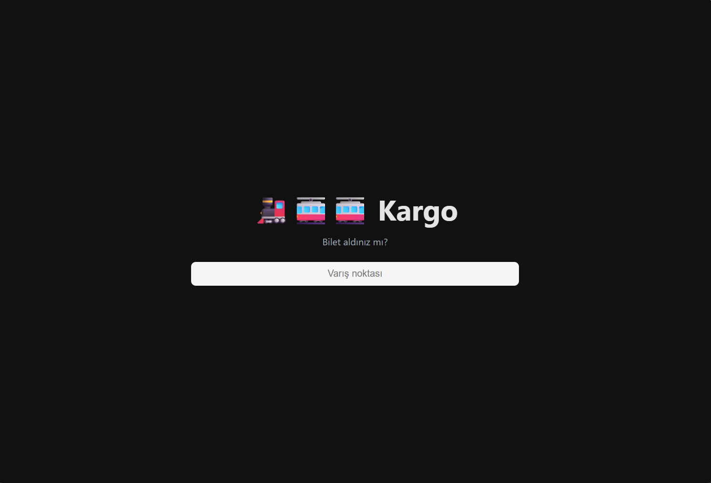
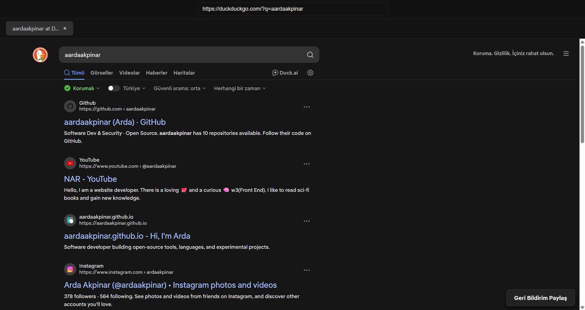
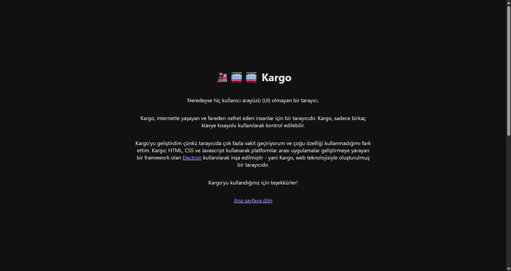

<p align="center">
  
  <h1 align="center">Kargo</h1>
</p>

<p align="center">
  Neredeyse hiç kullanıcı arayüzü (UI) olmayan bir tarayıcı.
</p>

Kargo, internette yaşayan ve fareden nefret eden insanlar için bir tarayıcıdır. Kargo, sadece birkaç klavye kısayolu kullanılarak kontrol edilebilir. Kargo, bir tarayıcının sadece en kullanışlı özelliklerini içerir; bu sayede internette gezinirken gereksiz özellikler sizi rahatsız edemez. Kargo'yu geliştirdim çünkü tercih ettiğim tarayıcıların (Chrome ve Firefox) sahip olduğu çoğu özelliği kullanmıyordum.

Kargo henüz çok erken aşamadadır ancak şimdiden kullanılabilir durumdadır; lütfen geliştirmeme yardımcı olun.

Denemek veya yüklemek için önceden derlenmiş [sürümlerimizden (binaries)](https://github.com/aardaakpinar/kargo/releases/latest) birini kullanabilirsiniz.

## Özellikler

- **Chrome**: Kargo, gücünü Chromium'dan alan Electron'un webview etiketlerini kullanır.
- **Sekmeler**: Diğer tüm tarayıcılar gibi Kargo da sekmeleri destekler, ancak bunları sizden gizler.
- **Geliştirici Araçları**: Kargo, Chrome'un geliştirici araçlarını tam olarak destekler.
- **Platformlar arası**: Kargo tüm platformlarda iyi görünür, Windows'taki başlık çubuğu bile şık durur.
- **Basit**: Kargo sadece çoğu insanın ihtiyaç duyduğu özelliklere sahiptir.
- **Sekme Kurtarma**: Kargo, açıldığında önceden açık olan sekmelerinizi otomatik olarak geri yükler.
- **Çok şirin**: 🚂🚋🚋 Kargo (web'i evinize taşır).

## Ekran Görüntüleri

##### Windows üzerinde Kargo ana sayfası



##### Duckduckgo (varsayılan arama motoru)



##### Windows üzerinde Kargo hakkında sayfası



## Klavye Kısayolları

<table>
    <tr>
        <td class="shortcut">Ctrl + T</td>
        <td>Yeni sekme aç</td>
    </tr>
    <tr>
        <td class="shortcut">Ctrl + X</td>
        <td>Mevcut sekmeyi kapat</td>
    </tr>
    <tr>
        <td class="shortcut">Ctrl + Shift + T</td>
        <td>Sekme çubuğunu göster/gizle</td>
    </tr>
    <tr>
        <td class="shortcut">Ctrl + Shift + ←</td>
        <td>Önceki sekme</td>
    </tr>
    <tr>
        <td class="shortcut">Ctrl + Shift + →</td>
        <td>Sonraki sekme</td>
    </tr>
    <tr>
        <td class="shortcut">Ctrl + 0</td>
        <td>Son sekmeye git</td>
    </tr>
    <tr>
        <td class="shortcut">Ctrl + 1-9</td>
        <td>Belirli sekmeye git</td>
    </tr>
    <tr>
        <td class="shortcut">Ctrl + ←</td>
        <td>Geri git</td>
    </tr>
    <tr>
        <td class="shortcut">Ctrl + →</td>
        <td>İleri git</td>
    </tr>
    <tr>
        <td class="shortcut">Ctrl + Shift + H</td>
        <td>Ana sayfaya git</td>
    </tr>
    <tr>
        <td class="shortcut">Ctrl + Shift + A</td>
        <td>Hakkında sayfasını aç</td>
    </tr>
    <tr>
        <td class="shortcut">Ctrl + R / F5</td>
        <td>Sayfayı yenile</td>
    </tr>
    <tr>
        <td class="shortcut">Ctrl + Shift + D</td>
        <td>DevTools'u aç</td>
    </tr>
    <tr>
        <td class="shortcut">F11</td>
        <td>Tam ekranı aç/kapat</td>
    </tr>
    <tr>
        <td class="shortcut">Esc</td>
        <td>İptal / Kapat</td>
    </tr>
</table>

## Gelecek

Kargo hala geliştirilme aşamasındadır, ancak hayallerimizdeki tarayıcıyı yapmak için birlikte çalışabiliriz.

#### YAPILACAKLAR (TODO)

- Testler
- Tasarım iyileştirmeleri
- Ayarlar

## Geliştirme

Kargo'yu derlemek için sadece [nodejs](https://nodejs.org) ve [npm](https://npmpkg.com) yüklü olması gerekir.

### Kargo'yu çalıştırma

Tüm bağımlılıkları yükleyin (bu işlem biraz zaman alabilir)

```
$ npm install
```

Run kargo

```
$ npm start
```

### Kargo'yu derleme

```
$ npm build
```

#### Belirli bir platform için derleme

**Mac**

```
$ npm build:mac
```

**Windows**

```
$ npm build:win
```

**Tüm platformlar**

```
$ npm build:all
```

## License

[The steamlocomotive logo](https://github.com/twitter/twemoji/blob/gh-pages/svg/1f682.svg) by [twemoji](https://github.com/twitter/twemoji) is licensed under [CC BY 4.0](https://creativecommons.org/licenses/by/4.0/).

MIT © [Arda](http://aardaakpinar.github.io)
